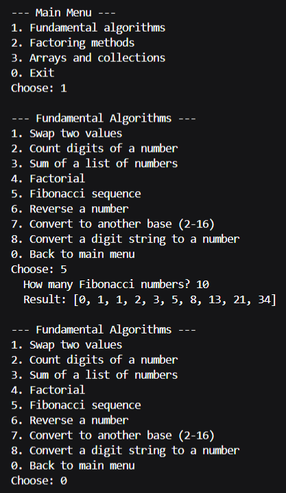
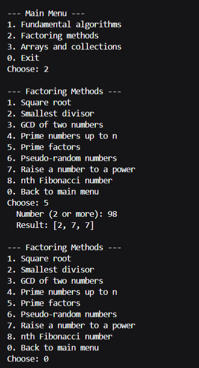
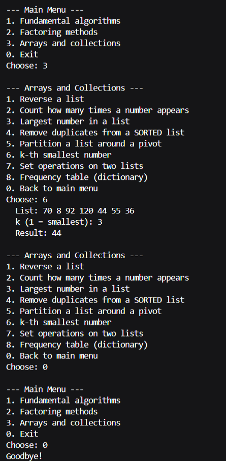
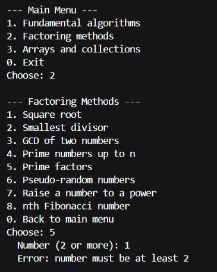
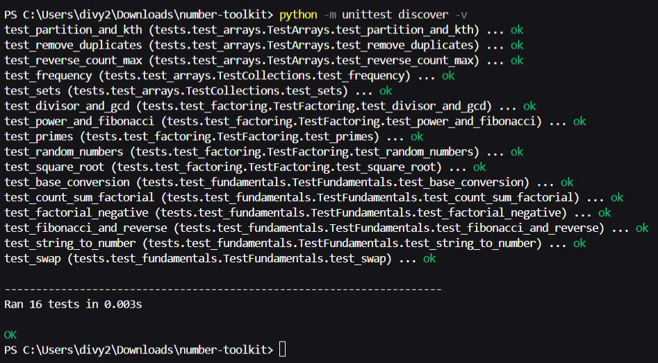

# Number Toolkit

A menu-driven command-line program for the **Python Essentials** course project (VITyarthi). It runs the main algorithms from the course, and every algorithm is written by hand instead of using built-in shortcuts like `math.gcd` or `sorted`.

See [statement.md](statement.md) for the problem statement, scope, target users and requirements.

## Overview
The program has three modules (fundamentals, factoring, arrays and collections). You choose what to run from numbered menus in the terminal.

## Features
| File | What it has |
|------|-------------|
| `toolkit/fundamentals.py` | swap (tuple assignment), count digits, sum, factorial, Fibonacci list, reverse a number, base conversion (2-16), string to number |
| `toolkit/factoring.py` | square root (Newton's method), smallest divisor, GCD (Euclid), primes, prime factors, pseudo-random numbers (LCG), power by repeated squaring, nth Fibonacci |
| `toolkit/arrays.py` | reverse, count, maximum, remove duplicates from a sorted list, partition, k-th smallest |
| `toolkit/collections_ops.py` | set operations, frequency dictionary |
| `toolkit/validators.py` | asks again until the user types a valid number or list |
| `toolkit/logger.py` | saves results and errors in `toolkit.log` |
| `main.py` | the menus (the part you run) |

## Technologies
Python 3.8 or newer, standard library only (`unittest` for testing, `time` for the log). Git for version control.

## Project Structure
```
main.py                     menus - start here
toolkit/
    __init__.py
    fundamentals.py  factoring.py  arrays.py  collections_ops.py
    validators.py    logger.py
tests/
    test_fundamentals.py  test_factoring.py  test_arrays.py
statement.md  README.md
```

## Install and Run
1. Clone the repository:
   ```
   git clone https://github.com/div-02/number-toolkit.git
   cd number-toolkit
   ```
2. Check that Python 3.8 or newer is installed:
   ```
   python --version
   ```
   (Use `python3` if `python` is not found.)
3. Nothing else needs to be installed and there is nothing to configure.
4. Run the program:
   ```
   python main.py
   ```

## How to Use
Type the number of a menu option and press Enter. Type `0` to go back or exit. If you type something invalid, the program tells you and asks again.

Example session (what you type is after the prompts):
```
=== Number Toolkit ===

--- Main Menu ---
1. Fundamental algorithms
2. Factoring methods
3. Arrays and collections
0. Exit
Choose: 2

--- Factoring Methods ---
...
Choose: 3
  First number: 48
  Second number: 18
  Result: 6
```

Quick test without typing (Linux/macOS): this chooses Factoring, then GCD of 48 and 18, then goes back and exits.
```
printf '2\n3\n48\n18\n0\n0\n' | python main.py
```

## Testing
From the project folder:
```
python -m unittest discover -v
```
This runs 16 tests that check every module, including wrong inputs.

## Logging
Results and errors are added to `toolkit.log` in the folder you run the program from.

## Screenshots

**Menu Choice 1**




**Menu Choice 2**




**Menu Choice 3**




**Error Case (for bad input)**




**All 16 tests passing**

